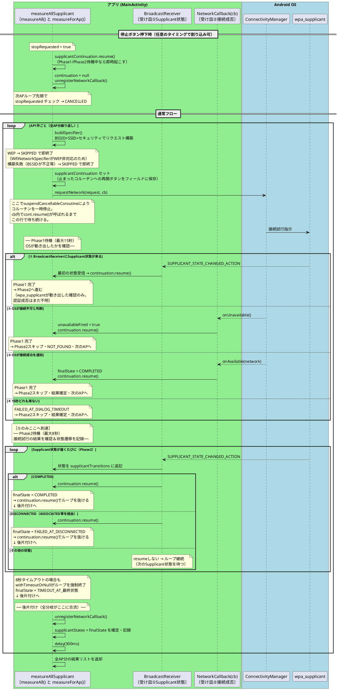

# 順次接続試行シーケンス図

## 補足

| フェーズ | 最大待機時間 | 早期終了条件 |
|---------|------------|------------|
| Phase1  | 15秒 (DIALOG_TIMEOUT_MS) | 最初のSupplicant状態受信 / onUnavailable() |
| Phase2  | 8秒 (AUTH_TIMEOUT_MS) | COMPLETED / DISCONNECTED(+ASSOCIATED等) |
| AP間    | 300ms固定 | なし |

## アプリが能動的に行っていること

- `requestNetwork()` の呼び出し（接続試行のトリガー）
- タイムアウト管理
- Supplicant状態の記録

## OSが行っていること（アプリ干渉不可）

- ダイアログ表示・非表示の判断
- 実際のWiFiフレーム送受信・認証処理
- `SUPPLICANT_STATE_CHANGED_ACTION` の発火タイミング
- `onAvailable()` / `onUnavailable()` の呼び出し
