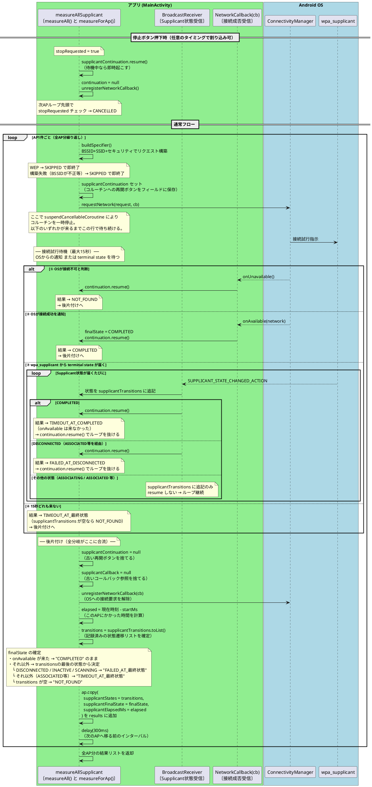

# 順次接続試行シーケンス図 ver2

Phase1/Phase2 の区別をなくし、接続試行を1本にまとめた案。

## ver1 との主な変更点

| 項目 | ver1 | ver2 |
|---|---|---|
| フェーズ数 | Phase1（15s）+ Phase2（8s）の2段 | 1本（15s）|
| BroadcastReceiverの役割 | Phase1：最初の状態で即 resume / Phase2：terminal state で resume | terminal state のみ resume（最初のイベントで resume しない） |
| `isFirst` ロジック | 必要 | 不要 |
| `suspendCancellableCoroutine` | 2回 | 1回 |
| タイムアウト種別 | FAILED_AT_DIALOG_TIMEOUT / TIMEOUT_AT_xxx の2種 | TIMEOUT_AT_xxx の1種 |

## 補足

| 待機 | 最大時間 | 早期終了条件 |
|---|---|---|
| 接続試行 | 15秒 | onAvailable / onUnavailable / terminal state 受信 |
| AP間 | 300ms固定 | なし |

## アプリが能動的に行っていること

- `requestNetwork()` の呼び出し（接続試行のトリガー）
- タイムアウト管理
- Supplicant状態の記録

## OSが行っていること（アプリ干渉不可）

- 実際のWiFiフレーム送受信・認証処理
- `SUPPLICANT_STATE_CHANGED_ACTION` の発火タイミング
- `onAvailable()` / `onUnavailable()` の呼び出し
