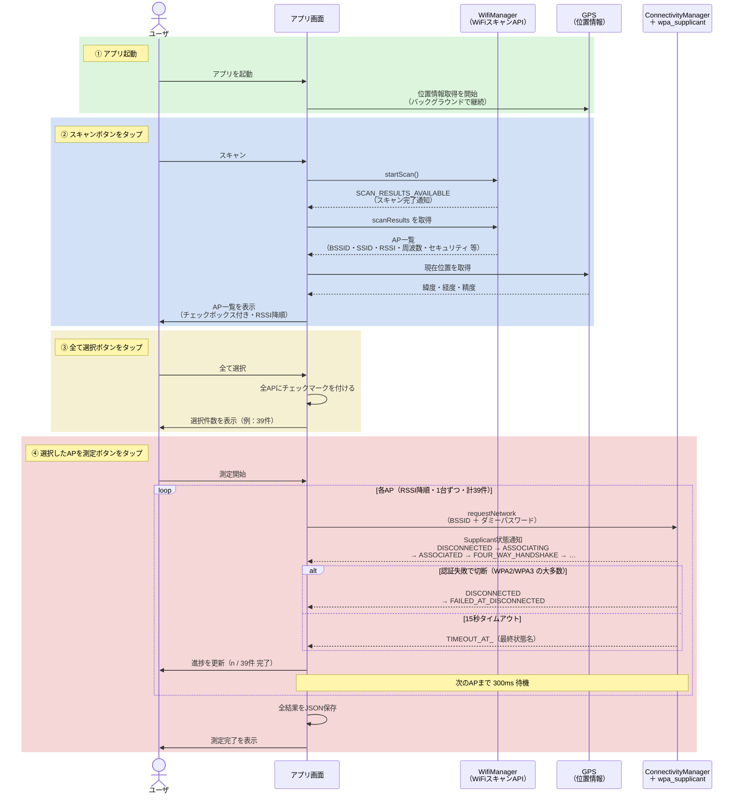
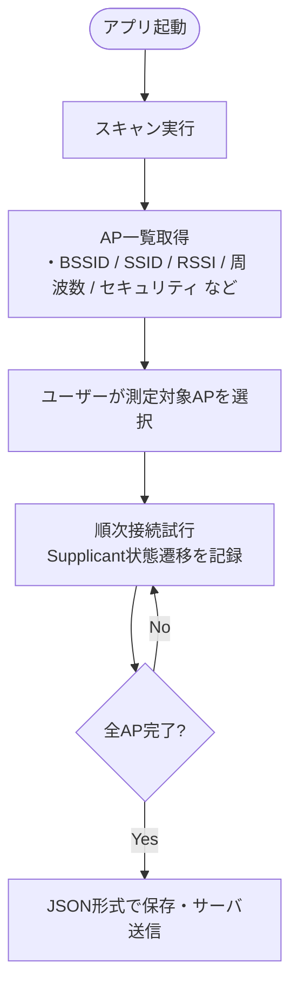
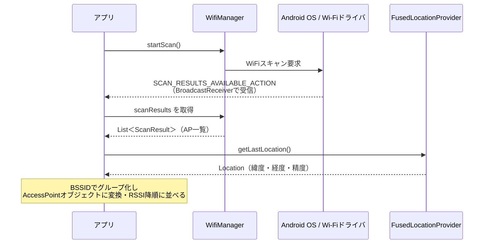
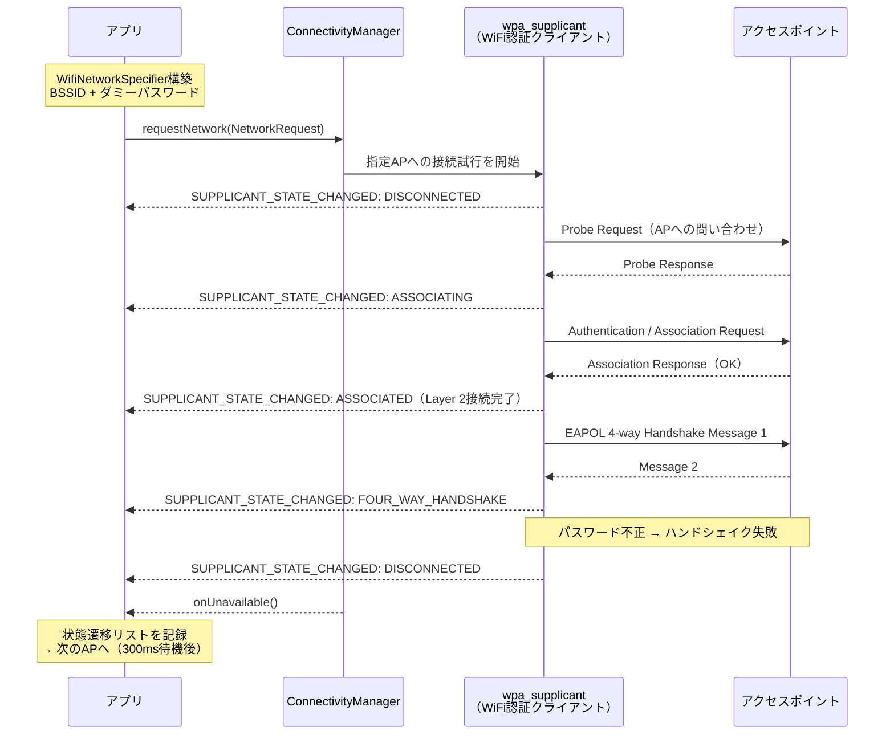
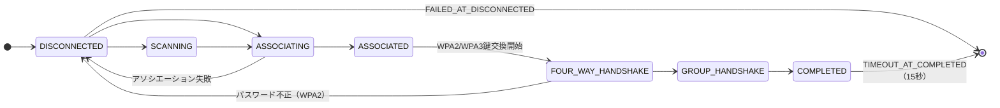
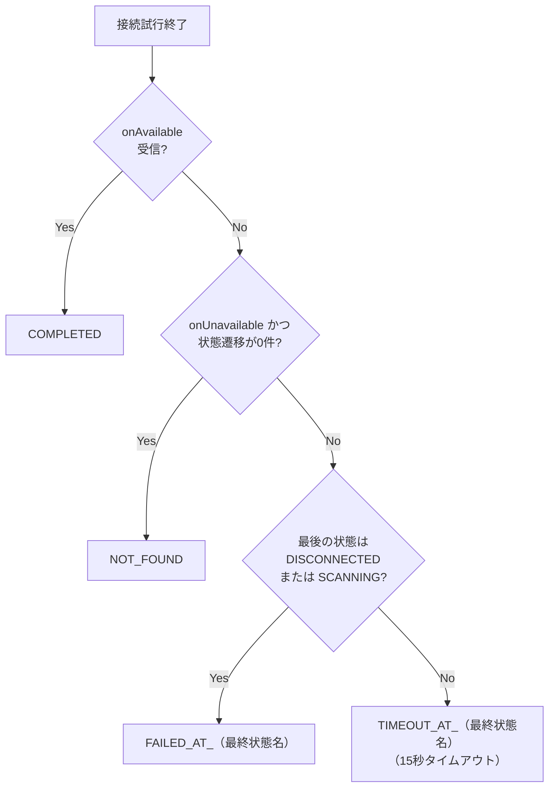

# 進捗報告：WiFi Supplicant状態測定アプリ

---

## 0. アプリ操作と内部動作の全体概要

ユーザの4つの操作それぞれで、アプリ内部でどのAPIが何をするかを1枚で示す。  
④の測定はAP1台ずつ順にループし、各APに最大15秒のタイムアウトが設定されている。



---

## 1. アプリの機能

本アプリはAndroidスマートフォンを用い、周辺のWiFiアクセスポイント（AP）を検出し、各APへの接続試行中の **Supplicant（認証クライアント）状態遷移** を記録する。

### 1.1 全体フロー



---

### 1.2 スキャン機能

「スキャン」とは、周辺に存在するWiFiアクセスポイントの一覧を取得する処理である。  
AndroidではWiFi管理を担う `WifiManager` クラスを通じてこれを行う。

#### 使用するAndroid API

| API | 役割 |
|-----|------|
| `WifiManager.startScan()` | OSにWiFiスキャンを要求する |
| `BroadcastReceiver`（`SCAN_RESULTS_AVAILABLE_ACTION`） | スキャン完了の通知をOSから受け取る |
| `WifiManager.scanResults` → `List<ScanResult>` | スキャン結果（AP一覧）を取得する |
| `FusedLocationProviderClient`（Google Play Services） | GPS位置情報（緯度・経度・精度）を取得する |

#### スキャンの流れ



#### `ScanResult` から取得できる情報

| フィールド | 内容 | 例 |
|-----------|------|----|
| `BSSID` | APのMACアドレス（物理的識別子） | `d0:56:f2:96:15:0f` |
| `SSID` | ネットワーク名（非公開APは空文字） | `0000mlab` |
| `level` | 電波強度（dBm）大きいほど強い | `-30` |
| `frequency` | 使用周波数（MHz） | `2447` → 2.4GHz帯 |
| `capabilities` | セキュリティ情報の生文字列 | `[WPA2-PSK-CCMP][ESS]` |
| `wifiStandard` | Wi-Fi世代コード（API30以上で正確） | `6`（802.11ax / Wi-Fi 6） |
| `channelWidth` | チャネル幅コード | 80MHz |
| `apMldMacAddress` | WiFi 7 MLD MACアドレス（API33以上・MLD対応APのみ） | `null` |

---

### 1.3 接続試行（Supplicant状態測定）

「接続試行」とは、検出した各APに対してAndroid OSを通じて接続要求を発行し、接続プロセス中の **wpa_supplicant**（WiFi認証を担うLinuxのプログラム）の状態遷移を記録する処理である。  
各APにはダミーのパスワードで接続を試みるため、実際には接続は完了しない。その過程でどの段階まで接続プロセスが進んだかを記録することが目的である。

#### 使用するAndroid API

| API | 役割 |
|-----|------|
| `WifiNetworkSpecifier` | 接続先APをBSSID・SSID・セキュリティ種別で指定する |
| `NetworkRequest` | WiFiネットワーク接続要求を構築する |
| `ConnectivityManager.requestNetwork()` | OSに接続試行を依頼する |
| `BroadcastReceiver`（`SUPPLICANT_STATE_CHANGED_ACTION`） | wpa_supplicantの状態変化通知を受け取る |
| `ConnectivityManager.NetworkCallback` | 接続成立（`onAvailable`）・失敗（`onUnavailable`）を受け取る |

#### 接続試行の流れ（WPA2 APの場合）



#### Supplicant状態一覧

| 状態名 | 意味 |
|--------|------|
| `DISCONNECTED` | 未接続状態（初期・切断後） |
| `INTERFACE_DISABLED` | WiFiインタフェース切替中（前APからの切断直後に出やすい） |
| `SCANNING` | APを探索中（ドライバレベルのスキャン） |
| `ASSOCIATING` | APへの認証・アソシエーション開始 |
| `ASSOCIATED` | Layer 2（MAC層）での接続完了 |
| `FOUR_WAY_HANDSHAKE` | WPA2/WPA3の4-wayハンドシェイク中（暗号鍵交換） |
| `GROUP_HANDSHAKE` | グループ鍵ハンドシェイク中（4-wayの後続処理） |
| `COMPLETED` | 認証完了（Layer 2まで接続確立） |

#### 代表的な状態遷移パターン



#### セキュリティ種別ごとの接続試行方法

| セキュリティ種別 | 試行方法 | 到達可能な最終状態 |
|----------------|---------|-----------------|
| WPA2-PSK | ダミーパスワード（WPA2） | `FAILED_AT_DISCONNECTED`（4-wayハンドシェイク後切断） |
| WPA3-SAE | ダミーパスワード（WPA3/SAE） | `FAILED_AT_DISCONNECTED`（ASSOCIATING段階で早期失敗） |
| WPA2/WPA3 | ダミーパスワード（WPA3） | `TIMEOUT_AT_COMPLETED`（COMPLETEDに到達する事象あり・要調査） |
| WPA2-EAP（eduroam等） | ダミーEAP認証情報（PEAP/MSCHAPv2） | 通常 `FAILED_AT_DISCONNECTED` |
| WEP | 非対応 | `SKIPPED`（測定スキップ） |

#### 最終状態の判定ロジック



---

## 2. 実験

### 2.1 実験条件

| 項目 | 内容 |
|------|------|
| 実施日時 | 2026年7月28日 13:14:15 |
| 端末 | Motorola moto g31(w)（Android API 30） |
| 測定場所 | 東北大学内（38.2456°N, 140.8518°E） |
| スキャン方法 | 手動スキャン1回 |
| 測定方法 | 検出AP全件をRSSI降順（強い順）に順次接続試行 |
| タイムアウト設定 | AP1件あたり最大15秒 |

### 2.2 実験手順


1. アプリを起動し「スキャン」ボタンをタップ
2. 周辺AP一覧が表示されたら「全て選択」をタップ
3. 「選択したAPを測定」ボタンをタップして測定開始
4. RSSIの降順（電波強度の強い順）にAPを1台ずつ順次接続試行し、Supplicant状態遷移を記録
5. 全AP測定完了後、結果をJSON形式で保存

---

## 3. 結果

### 3.1 概要

| 項目 | 値 |
|------|----|
| 検出AP数 | **39件** |
| 2.4GHz帯 | 17件 |
| 5GHz帯 | 22件 |
| 推定総測定時間 | 約4分 |

**セキュリティ種別の内訳：**

| セキュリティ | AP数 |
|-------------|------|
| WPA2 | 29件 |
| WPA3 | 8件 |
| WPA2/WPA3 | 2件 |
| **合計** | **39件** |

**最終状態の分布：**

| 最終状態 | AP数 | 説明 |
|---------|------|------|
| `FAILED_AT_DISCONNECTED` | 34件 | 切断状態で終了（ダミーパスワードによる認証失敗） |
| `TIMEOUT_AT_COMPLETED` | 3件 | COMPLETEDに到達したが15秒タイムアウト（要調査） |
| `TIMEOUT_AT_FOUR_WAY_HANDSHAKE` | 1件 | 4-wayハンドシェイク中に15秒タイムアウト |
| `FAILED_AT_SCANNING` | 1件 | SCANNING段階で失敗（電波が弱すぎてAP到達不可） |

### 3.2 全AP測定結果

| # | SSID | BSSID | RSSI (dBm) | 帯域 | セキュリティ | 最終状態 | 経過時間 (ms) |
|---|------|-------|-----------|------|------------|---------|-------------|
| 1 | 0000mlab | d0:56:f2:96:15:0f | -30 | 2.4GHz | WPA3 | FAILED_AT_DISCONNECTED | 1,847 |
| 2 | 0000mlab-2.4ver2 | d0:56:f2:96:15:08 | -31 | 2.4GHz | WPA2 | FAILED_AT_DISCONNECTED | 4,474 |
| 3 | Mlab_ST2.4 | ec:5a:31:9d:5e:92 | -36 | 2.4GHz | WPA2 | **TIMEOUT_AT_FOUR_WAY_HANDSHAKE** | **15,010** |
| 4 | （非公開） | ec:5a:31:9d:5e:91 | -38 | 2.4GHz | WPA2/WPA3 | **TIMEOUT_AT_COMPLETED** | 1,622 |
| 5 | Mlab_ST2.4-WPA3 | ec:5a:31:9d:5e:93 | -38 | 2.4GHz | WPA3 | FAILED_AT_DISCONNECTED | 4,497 |
| 6 | hatake_Rk26-2.4 | 90:96:f3:5d:15:d1 | -39 | 2.4GHz | WPA2 | FAILED_AT_DISCONNECTED | 4,512 |
| 7 | 0000mlab | d0:56:f2:96:15:17 | -40 | 5GHz | WPA3 | FAILED_AT_DISCONNECTED | 5,091 |
| 8 | 0000mlab-5ver2 | d0:56:f2:96:15:10 | -40 | 5GHz | WPA2 | FAILED_AT_DISCONNECTED | 4,474 |
| 9 | Mlab_ST5-WPA3 | ec:5a:31:9d:5e:9a | -44 | 5GHz | WPA3 | FAILED_AT_DISCONNECTED | 2,234 |
| 10 | （非公開） | ec:5a:31:9d:5e:98 | -44 | 5GHz | WPA2/WPA3 | **TIMEOUT_AT_COMPLETED** | 3,708 |
| 11 | Mlab_ST5 | ec:5a:31:9d:5e:99 | -45 | 5GHz | WPA2 | FAILED_AT_DISCONNECTED | 5,700 |
| 12 | 0000tohtech-iot | b0:1f:8c:7f:99:31 | -46 | 5GHz | WPA2 | FAILED_AT_DISCONNECTED | 10,214 |
| 13 | eduroam | b0:1f:8c:7f:99:32 | -46 | 5GHz | WPA2 | FAILED_AT_DISCONNECTED | 768 |
| 14 | 0000tohtech-lab | b0:1f:8c:7f:99:33 | -46 | 5GHz | WPA2 | FAILED_AT_DISCONNECTED | 750 |
| 15 | Buffalo-G-AEBE | 84:af:ec:b3:ae:b0 | -51 | 2.4GHz | WPA2 | FAILED_AT_DISCONNECTED | 12,123 |
| 16 | Buffalo-G-2BF8-WPA3 | c4:36:c0:91:2c:07 | -51 | 2.4GHz | WPA3 | FAILED_AT_DISCONNECTED | 15,008 |
| 17 | Buffalo-G-2BF8 | c4:36:c0:91:2c:00 | -53 | 2.4GHz | WPA2 | FAILED_AT_DISCONNECTED | 3,652 |
| 18 | MLAB-TECH01 | 92:96:f3:c3:6f:12 | -55 | 2.4GHz | WPA2 | FAILED_AT_DISCONNECTED | 7,819 |
| 19 | MLAB-TECH01-24-3 | 92:96:f3:c3:6f:13 | -55 | 2.4GHz | WPA3 | FAILED_AT_DISCONNECTED | 3,433 |
| 20 | Galaxy_5GMW_1331 | 5e:a6:39:62:4c:1a | -56 | 2.4GHz | WPA2 | FAILED_AT_DISCONNECTED | 7,361 |
| 21 | eduroam | b0:1f:8c:7f:99:22 | -56 | 2.4GHz | WPA2 | FAILED_AT_DISCONNECTED | 931 |
| 22 | 0000tohtech-lab | b0:1f:8c:7f:99:23 | -56 | 2.4GHz | WPA2 | FAILED_AT_DISCONNECTED | 1,540 |
| 23 | Buffalo-A-2BF8 | c4:36:c0:91:2c:08 | -58 | 5GHz | WPA2 | FAILED_AT_DISCONNECTED | 7,089 |
| 24 | Buffalo-A-2BF8-WPA3 | c4:36:c0:91:2c:0f | -58 | 5GHz | WPA3 | FAILED_AT_DISCONNECTED | 1,649 |
| 25 | MLAB-TECH01-5-2 | 90:96:f3:c3:6f:19 | -59 | 5GHz | WPA2 | FAILED_AT_DISCONNECTED | 4,490 |
| 26 | MLAB-TECH01-5-3 | 90:96:f3:c3:6f:1a | -59 | 5GHz | WPA3 | FAILED_AT_DISCONNECTED | 14,746 |
| 27 | FujitaLab | 60:45:cb:b0:69:00 | -65 | 2.4GHz | WPA2 | FAILED_AT_DISCONNECTED | 12,215 |
| 28 | eduroam | b0:1f:8c:7f:b9:22 | -71 | 2.4GHz | WPA2 | FAILED_AT_DISCONNECTED | 5,063 |
| 29 | 0000tohtech | b0:1f:8c:7f:b9:21 | -72 | 2.4GHz | WPA2 | FAILED_AT_DISCONNECTED | 7,810 |
| 30 | 0000tohtech-iot | b0:1f:8c:7f:8d:b1 | -76 | 5GHz | WPA2 | FAILED_AT_DISCONNECTED | 10,258 |
| 31 | 0000tohtech | b0:1f:8c:7f:8d:b2 | -77 | 5GHz | WPA2 | FAILED_AT_DISCONNECTED | 748 |
| 32 | 0000tohtech-lab | b0:1f:8c:7f:8d:b3 | -77 | 5GHz | WPA2 | FAILED_AT_DISCONNECTED | 612 |
| 33 | eduroam | b0:1f:8c:7f:8d:b0 | -78 | 5GHz | WPA2 | FAILED_AT_DISCONNECTED | 2,690 |
| 34 | aterm-37ecd5-a | 08:10:86:20:50:47 | -93 | 5GHz | WPA2 | **FAILED_AT_SCANNING** | **15,008** |
| 35 | 0000tohtech-iot | 20:9c:b4:96:f5:b1 | -94 | 5GHz | WPA2 | FAILED_AT_DISCONNECTED | 13,645 |
| 36 | 0000tohtech-lab | 20:9c:b4:96:f5:b3 | -94 | 5GHz | WPA2 | FAILED_AT_DISCONNECTED | 5,721 |
| 37 | eduroam | 20:9c:b4:97:dc:f0 | -94 | 5GHz | WPA2 | **TIMEOUT_AT_COMPLETED** | 3,551 |
| 38 | 0000tohtech | 20:9c:b4:96:f5:b0 | -95 | 5GHz | WPA2 | FAILED_AT_DISCONNECTED | 863 |
| 39 | eduroam | 20:9c:b4:96:f5:b2 | -95 | 5GHz | WPA2 | FAILED_AT_DISCONNECTED | 796 |

### 3.3 特徴的なSupplicant状態遷移の例

#### パターンA：WPA2-PSK（典型的な失敗）

**対象：** `0000mlab-2.4ver2`（d0:56:f2:96:15:08、-31 dBm）

```
INTERFACE_DISABLED → DISCONNECTED → ASSOCIATING → ASSOCIATED
  → FOUR_WAY_HANDSHAKE → DISCONNECTED
```

**最終状態：** `FAILED_AT_DISCONNECTED`（4,474 ms）

4-wayハンドシェイク（鍵交換）に進んだが、ダミーパスワードのため失敗し切断。これが WPA2-PSK APの典型的な遷移である。

---

#### パターンB：WPA3-SAE（早期失敗）

**対象：** `0000mlab`（d0:56:f2:96:15:0f、-30 dBm）

```
DISCONNECTED → INTERFACE_DISABLED → DISCONNECTED
  → ASSOCIATING → DISCONNECTED → ASSOCIATING → DISCONNECTED
```

**最終状態：** `FAILED_AT_DISCONNECTED`（1,847 ms）

WPA3はSAE（Simultaneous Authentication of Equals）プロトコルを使用するため、認証失敗がASSOCIATING段階（WPA2でいうFOUR_WAY_HANDSHAKEより前）で発生する。WPA2より早く終了する傾向がある。

---

#### パターンC：WPA2/WPA3混在モードでCOMPLETEDに到達（要調査）

**対象：** `（非公開）`（ec:5a:31:9d:5e:91、-38 dBm）・`（非公開）`（ec:5a:31:9d:5e:98、-44 dBm）

```
INTERFACE_DISABLED → DISCONNECTED → ASSOCIATING → ASSOCIATED
  → FOUR_WAY_HANDSHAKE → GROUP_HANDSHAKE → COMPLETED
```

**最終状態：** `TIMEOUT_AT_COMPLETED`（それぞれ 1,622 ms、3,708 ms）

ダミーパスワードにもかかわらず、Layer 2接続確立を意味する `COMPLETED` に到達した。  
これら2件は `capabilities_raw` に `[RSN-PSK+SAE-CCMP]`（WPA2とWPA3の混在モード）を含むAPである。  
同じSSIDのWPA3専用AP（`ec:5a:31:9d:5e:93`）では `FAILED_AT_DISCONNECTED` となっており、混在モード特有の挙動と考えられる。

また `eduroam`（20:9c:b4:97:dc:f0、WPA2-EAP with Fast Transition）でも同様の遷移が観測された（`TIMEOUT_AT_COMPLETED`、3,551 ms）。

---

#### パターンD：電波が弱すぎてSCANNING段階で失敗

**対象：** `aterm-37ecd5-a`（08:10:86:20:50:47、-93 dBm）

```
INTERFACE_DISABLED → DISCONNECTED → SCANNING
```

**最終状態：** `FAILED_AT_SCANNING`（15,008 ms = タイムアウト）

RSSI -93 dBm という非常に弱い電波のAPに対し、ドライバレベルのSCANNING段階でAPを発見できないまま15秒タイムアウトした。ASSOCIATINGに進めなかった唯一のケースである。

---

#### パターンE：4-wayハンドシェイク中にタイムアウト

**対象：** `Mlab_ST2.4`（ec:5a:31:9d:5e:92、-36 dBm）

```
INTERFACE_DISABLED → DISCONNECTED → SCANNING → ASSOCIATING
  → ASSOCIATED → FOUR_WAY_HANDSHAKE
```

**最終状態：** `TIMEOUT_AT_FOUR_WAY_HANDSHAKE`（15,010 ms）

同じSSIDの他のAP（`Mlab_ST2.4-WPA3`、-38 dBm）は `FAILED_AT_DISCONNECTED` で正常に切断されるのに対し、このAPのみFOUR_WAY_HANDSHAKEに入ったまま切断されずタイムアウトした。AP側の応答に問題がある可能性がある。
